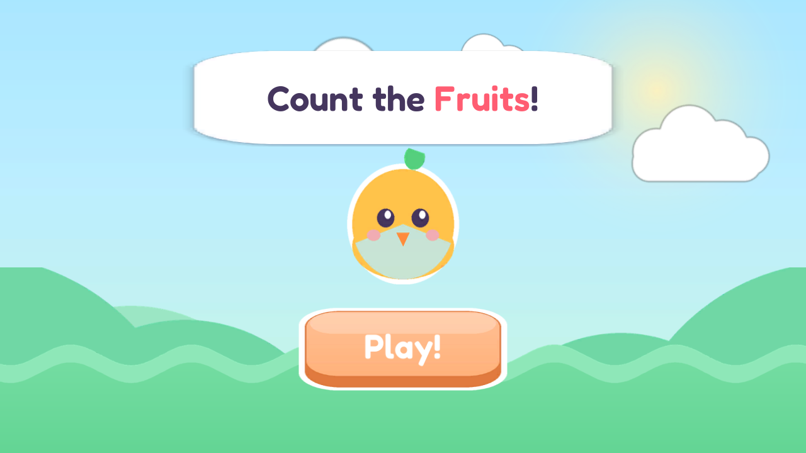
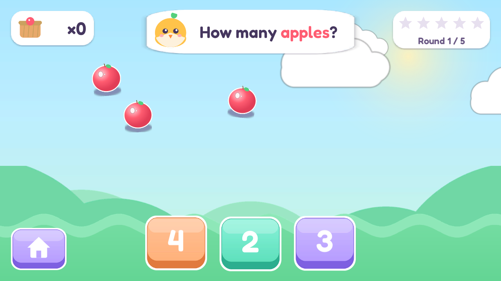
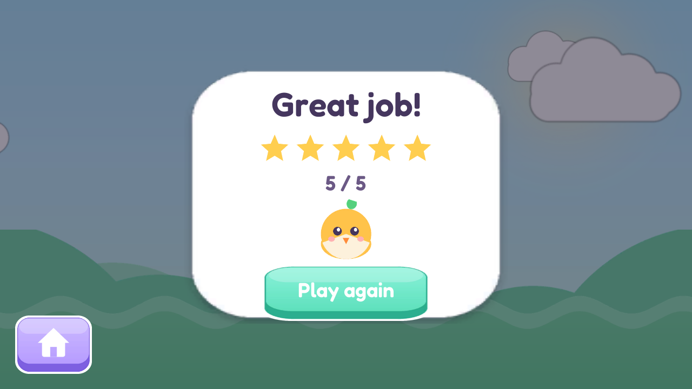

# Kids Adventure 🎈

A polished, kid-friendly **mini-game package** made in Unity. A Kiddopia-style home screen
links three gentle, no-fail games — tap a tile to play, and the pink 🏠 **Home** button
(top-left in every game) brings you back to the hub.

> ### Built entirely by [LoomTide](https://github.com/Loomtide)
> Every part of this package was produced automatically by **LoomTide** — the game design,
> the C# gameplay code, and **all of the art and audio**. The soft rounded-vector sprites,
> the mascots, the UI, the sound effects, and the background music are **procedurally
> generated** (see [`Tools/`](Tools/)) — nothing is hand-drawn, stock, or licensed.

🎬 **Gameplay video**

https://github.com/user-attachments/assets/918fe3d5-53c1-4139-a9cb-31282f5e717b

## The mini-games

### 🍎 Count the Fruits
Count the apples scattered on screen, tap the button with the matching number, and clear
five rounds of rising counts (**3 → 7** apples) to earn a full row of stars. Correct →
confetti, a happy chime, and a star; wrong → a gentle shake and buzz — just try again.

| Start | Gameplay | Results |
|---|---|---|
|  |  |  |

### 🔷 Shape Match
One target shape, three answer tiles — tap the one that matches. Five rounds with star
progress and a **Great job!** reward screen. Gentle and no-fail, just like the others.

### 🧇 Kids Chef
Cook waffles in three steps with a friendly bear chef: **drag** the ingredients into the
bowl and **stir** the batter smooth, **spray** + **pour** + press the glowing button to
cook, then **decorate** your waffle with strawberries, cream, and syrup. Finishes with
confetti, stars, and a proud mascot.

## Running it

Open the project in **Unity 6000.3 LTS** (`6000.3.9f1`), open
`Assets/Scenes/KidsAdventure.unity` (the hub), and press **Play**. It works with the mouse
on desktop and touch on device. Each game scene also runs standalone.

## How the assets are generated

All art and audio are created by small Python scripts (PIL · NumPy · fontTools) under
[`Tools/`](Tools/). Re-run any of them to regenerate the matching assets:

| Script | Generates |
|---|---|
| `gen_home.py` / `gen_home_music.py` | the hub — logo, tiles, balloons, sparkles + its music loop |
| `gen_bg.py` | sky, sun, rolling hills, ground, and clouds |
| `gen_fruit.py` | the apples |
| `gen_hud.py` | white cards, basket, stars, and the mascot |
| `gen_buttons.py` | the answer / action buttons |
| `gen_fx.py` | sparkle / confetti / "counted" check effects |
| `gen_music.py` | the counting game's music loop, fanfare, and Play jingle |
| `gen_shapes.py` | the Shape Match shapes, tiles, and backdrop |
| `gen_chef.py` / `gen_chef_audio.py` | the Kids Chef kitchen, bear chef, ingredients, waffle maker + cooking SFX |

## Project layout

- `Assets/Scenes/` — `KidsAdventure` (the hub, first in Build Settings), `CountTheFruits`,
  `ShapeMatch`, `KidsChef`
- `Assets/Scripts/` — `Home` (hub) · `Core` / `Interactables` / `UI` / `FX` (Count the
  Fruits) · `ShapeMatch` · `Chef` — each game is namespaced and self-contained
- `Assets/Art/{home,bg,fruit,fx,hud,ui,shapematch,chef}` — generated sprites
- `Assets/Audio/` — generated music + sound effects
- `Assets/Fonts/` — Fredoka (display) + Nunito (UI)
- `Assets/Editor/` — scene builders (rebuild any scene from the "KidsAdventure" menu)
- `Tools/` — the asset generators

## Requirements

- Unity **6000.3 LTS**
- Packages: 2D Sprite, 2D Pixel Perfect, Input System, uGUI, Animation, Audio, Physics2D
